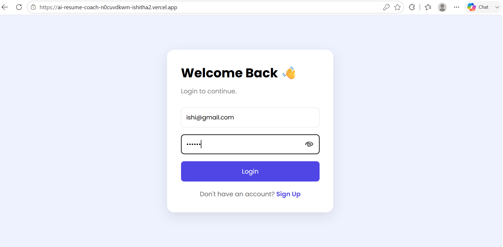
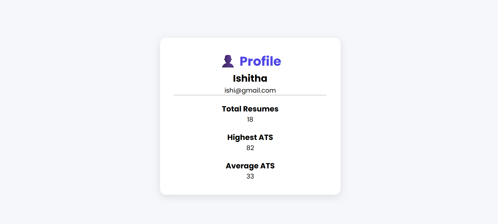
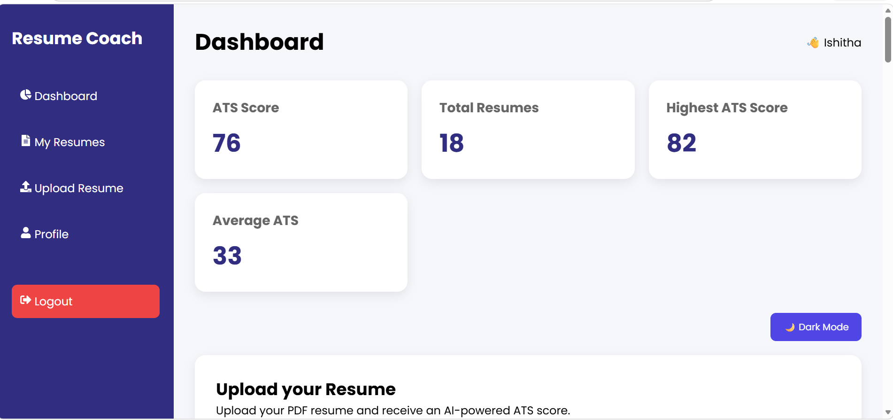
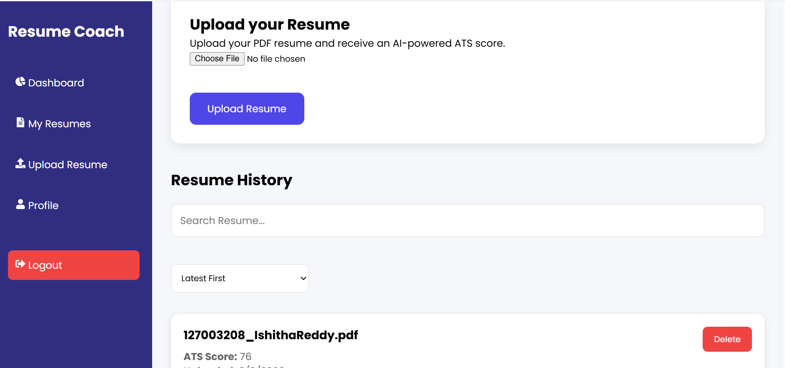
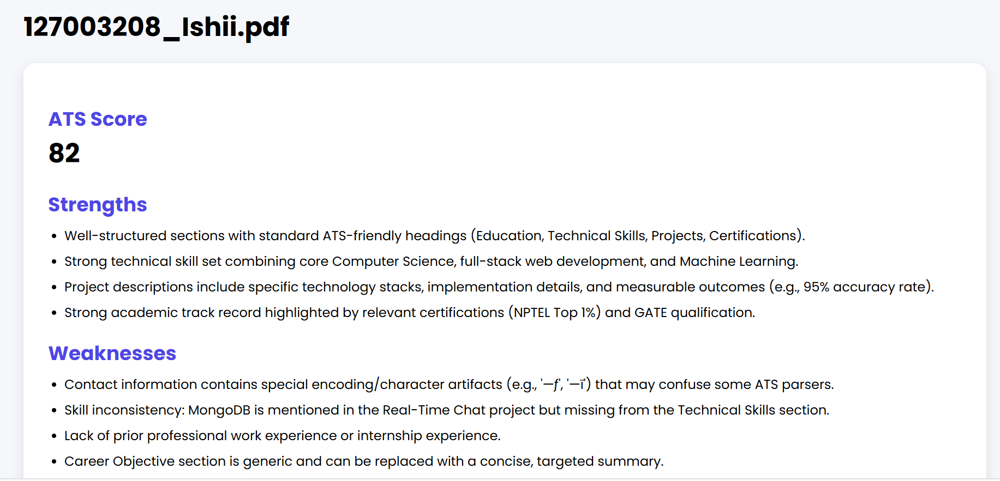
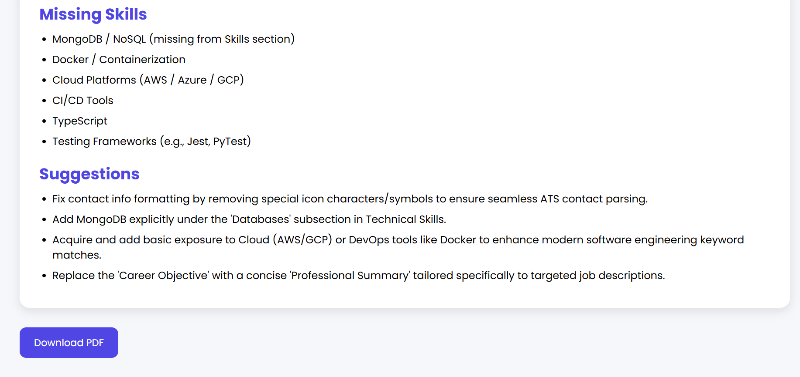

# AI Resume Coach

An AI-powered resume analysis platform that helps users improve their resumes by providing ATS scores, personalized feedback, and job-oriented suggestions.

## Features

- User Authentication (JWT)
- Resume Upload (PDF)
- AI Resume Analysis
- ATS Score Generation
- Strengths & Weaknesses Detection
- Resume Improvement Suggestions
- Responsive User Interface

## Tech Stack

### Frontend
- React.js
- CSS
- Axios

### Backend
- Node.js
- Express.js
- MongoDB Atlas
- JWT Authentication
- Multer
- pdf-parse

### AI
- Google Gemini API

## Project Structure

AI-Resume-Coach/
- client/
- server/
- README.md

## Installation

### Clone Repository

```bash
git clone YOUR_GITHUB_LINK
```

### Frontend

```bash
cd client
npm install
npm start
```

### Backend

```bash
cd server
npm install
npm run dev
```
## Environment Variables

### Frontend (.env)

```
REACT_APP_API_URL=YOUR_BACKEND_URL
```

### Backend (.env)

```
MONGO_URI=YOUR_MONGODB_URI
JWT_SECRET=YOUR_SECRET_KEY
GEMINI_API_KEY=YOUR_API_KEY
```

## Screenshots

### Login



### Profile




### Dashboard



### Resume Upload




### Resume Analysis



### Download Analysis




## Live Demo

Frontend: [YOUR_VERCEL_LINK](https://ai-resume-coach-n0cuvdkwm-ishitha2.vercel.app/)

Backend: [YOUR_RENDER_LINK](https://ai-resume-coach-backend-hktm.onrender.com/api)

## Author

**Ishitha Reddy**

GitHub: https://github.com/IshithaReddy29

